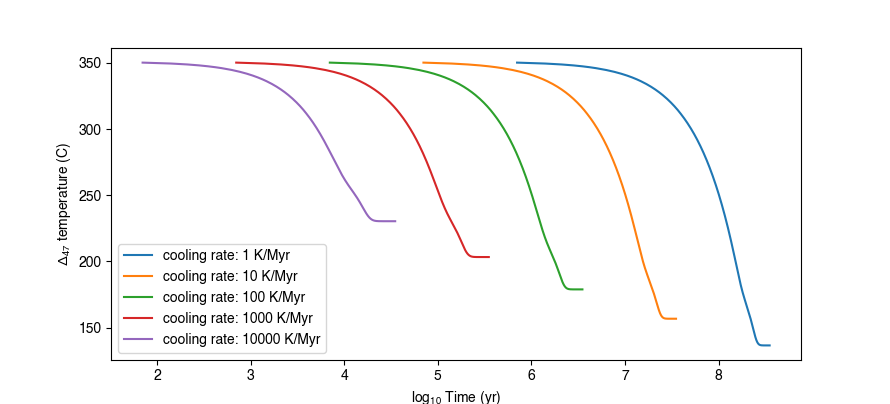

Examples
========

The following is a collection of detailed examples highlighting various aspects of the ``isotopylog`` functionality, in addition to the basic walkthough shown in the "quick guide". These examples will be updated regularly.

Cooling Plots
-------------

One way to visualize equilibrium blocking temperature is to generate plots analogous to Figure 12 in Stolper and Eiler (2015). The following code walks through how to generate this plot, which can be done for any of the model types used in ``isotopylog``::

	#recreate SE15 Fig. 12

	#import literature E distribution data
	ed = ipl.EDistribution.from_literature(
		mineral = 'calcite', 
		reference = 'SE15', 
		Tref = 700
		)

	#input time/temperature data
	betas = np.array([1, 10, 100, 1000, 10000]) #K/million years
	T0 = 350 + 273.15 #Kelvin
	Tf = 0 + 273.15 #Kelvin
	nt = 500

	#input initial isotope composition
	D0 = ipl.Deq_from_T(T0)
	d0 = [D0, 0, 0]
	d0_std = [0.013, 0, 0]

	#make figure
	fig, ax = plt.subplots(1,1)

	for beta in betas:

		#get t array, in seconds
		t0 = 0
		tf = (T0-Tf)/beta #million years
		tf = tf*1e6*365*24*3600 # seconds

		t = np.linspace(t0, tf, nt)
		T = np.linspace(T0, Tf, nt)

		#calculate D at each time step
		D, Dstd = ipl.geologic_history(t, T, ed, d0, d0_std = d0_std)

		#convert D into apparent temperature
		Tapp = ipl.T_from_Deq(D)

		#make label text
		lab = 'cooling rate: %s K/Myr' % beta

		#add to plot
		ax.plot(np.log10(t[1:]/(365*24*3600)), Tapp[1:] - 273,
			label = lab)

	#set axis labels
	ax.set_xlabel(r'$log_{10}$ Time (yr)')
	ax.set_ylabel(r'$\Delta_{47}$ temperature (C)')

	#add legend
	ax.legend(loc = 'best')

