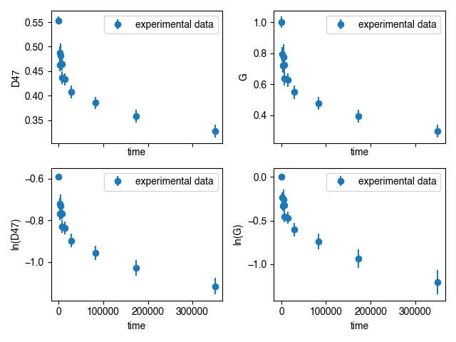
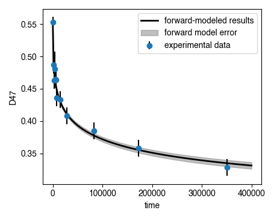
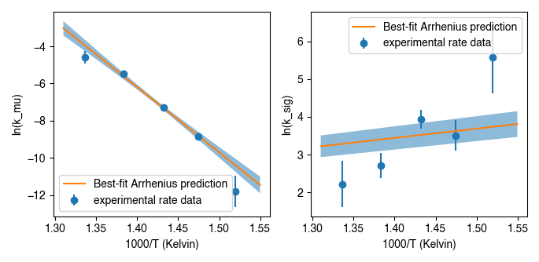
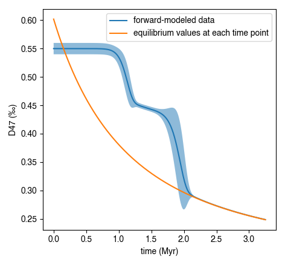
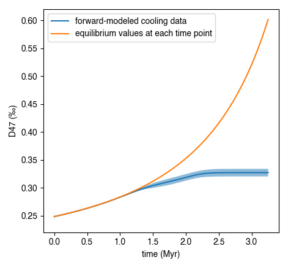

Quick Guide
===========
The following should form a quick reference walkthough of downloading the package, getting experimental data into the right form for importing, running the inverse models to generate activation energies, importing published kinetic values and updating them using new experimental data, and generating predicted clumped isotope evolution for a given time-temperature history.

For detailed information on class attributes, methods, and parameters, consult the `Package Reference Documentation` or use the ``help()`` command from within Python.

Downloading the package
-----------------------

Using the ``pip`` package manager
~~~~~~~~~~~~~~~~~~~~~~~~~~~~~~~~~
``isotopylog`` and the associated dependencies can be downloaded directly from the command line using ``pip``::

	$ pip install isotopylog

You can check that your installed version is up to date with the latest release by doing::

	$ pip freeze

Downloading from source
~~~~~~~~~~~~~~~~~~~~~~~
Alternatively, ``isotopylog`` source code can be downloaded directly from `the github repo <http://github.com/FluvialSeds/isotopylog>`_. Or, if you have git installed::

	$ git clone git://github.com/FluvialSeds/isotopylog.git

And keep up-to-date with the latest version by doing::

	$ git pull

from within the isotopylog directory.

Dependencies
~~~~~~~~~~~~
The following packages are required to run ``isotopylog``:

* `python <http://www.python.org>`_ >= 2.7, including Python 3.x

* `matplotlib <http://matplotlib.org>`_ >= 1.5.2

* `numpy <http://www.numpy.org>`_ >= 1.11.1

* `pandas <http://pandas.pydata.org>`_ >= 0.18.1

* `scipy <http://www.scipy.org>`_ >= 0.18.0

If downloading using ``pip``, these dependencies (except python) are installed
automatically.

Optional Dependencies
~~~~~~~~~~~~~~~~~~~~~
The following packages are not required but are highly recommended:

* `ipython <http://www.ipython.org>`_ >= 4.1.1

Additionally, if you are new to the Python environment or programming using the command line, consider using a Python integrated development environment (IDE) such as:

* `wingware <http://wingware.com>`_

* `Enthought Canopy <https://store.enthought.com/downloads/#default>`_

* `Anaconda <https://www.continuum.io/downloads>`_

* `Spyder <https://github.com/spyder-ide/spyder>`_

Python IDEs provide a "MATLAB-like" environment as well as package management. This option should look familiar for users coming from a MATLAB or RStudio background.

Importing Experimental Data
---------------------------

If you are using ``isotopylog`` to fit reordering rate parameters to new clumped isotope heating experiments, then the first step is to import those data in an appropriate format. This requires making a .csv file that contains the following columns:

* t 
* D47 
* D47_std 
* d13C_vpdb 
* d13C_std 
* d18O_vpdb 
* d18O_std 
* T_C
* ref_frame 
* iso_params 

where the first entry contains the initial (unheated) isotope data. The "t" column can contain time points in any units (e.g., seconds, minuts, etc.), and note that the resulting rate data will correspond to the time unit used. The "ref_frame" column contains the reference frame used to generate the clumped isotope data (i.e., "Ghosh25", "Ghosh90", "CDES25", or "CDES90"), whereas the "iso_params" column contains the isotope parameters used to generate the clumped isotope data (typically "Gonfiantini" for older data or "Brand" for recently generated data. See Daëron et al.(2016) for further details).

Once this table is made, it can be easily imported into an ``isotopylog.HeatingExperiment`` object::
	
	#import packages
	import isotopylog as ipl

	#make a string pionting to the file
	file = '/path/to/data/data_file.csv'

	#import the data to a heatingexperiment object, he
	he = ipl.HeatingExperiment.from_csv(file, culled = False)

Note that users can choose to cull the data such that any measurements within some threshold of the equilibrium value at that temperature are excluded (see Passey and Henkes (2012) for details). The culling threshold is defined by the number of analytical standard deviations away from equilibrium (i.e., if ``cull_thresh = 1``, then any data within 1 sigma of equilibrium is discarded)::
	
	#import the data to a heatingexperiment object, he, now culling data
	he = ipl.HeatingExperiment.from_csv(file, culled = True, cull_sig = 1)

Finally, this imported data can be visualized by plotting in various ways::
	
	#import additional packages
	import matplotlib.pyplot as plt

	#make an axis
	fig, ax = plt.subplots(2,2,sharex = True)

	#first, plot D
	ax[0,0] = he.plot(ax = ax[0,0], yaxis = 'D', logy = False)

	#second, plot G
	ax[0,1] = he.plot(ax = ax[0,1], yaxis = 'G', logy = False)

	#third, plot log(D)
	ax[1,0] = he.plot(ax = ax[1,0], yaxis = 'D', logy = True)

	#finally, plot log(G)
	ax[1,1] = he.plot(ax = ax[1,1], yaxis = 'G', logy = True)

Calculating Rate Parameters
---------------------------

The next step is to fit the heating experiment data with one of the avaialable kinetic models in order to generate rate parameters. This is done as follows::
	
	#for fitting the Passey and Henkes 2012 model:
	kd_ph = ipl.kDistribution.invert_experiment(
		he,
		model = 'PH12',
		thresh = 1e-8, #needed to determine which points are "linear"
		)

	#for fitting the Henkes et al. 2012 model:
	kd_hea = ipl.kDistribution.invert_experiment(
		he,
		model = 'Hea14',
		)

	#for fitting the Stolper and Eiler (2015) model:
	kd_se = ipl.kDistribution.invert_experiment(
		he,
		model = 'SE15',
		mp = 0.0992 #can pass a value to force the pair/pair_random slope
		)

	#finally, for fitting the Hemingway and Henkes (2021) model:
	kd_hh = ipl.kDistribution.invert_experiment(
		he,
		model = 'HH21',
		fit_inv = True #include the inversion as well as the lognormal fits
		)

And resulting rate data can be seen and exported as follows::

	#to see the data on the command line
	kd_hh

	#to export as csv
	kdsum = kd_hh.summary
	kdsum.to_csv('name_of_file.csv')

Forward Modeling and Visualizing Results
~~~~~~~~~~~~~~~~~~~~~~~~~~~~~~~~~~~~~~~~

Once the rate parameters are calculated, one can plot these back on to the measured experimental data to visualize fits::
	
	#forward model the data
	he.forward_model(kd_hh)

	#now re-plot
	fig, ax = plt.subplots(1,1)

	#experimental data plt.errorbar dict
	ed = {'fmt' : 'o', 'ecolor' : 'k'}

	#forward-modeled mean plt.plot dict
	ld = {'linewidth' : 2, 'c' : 'k'}

	#forward-modeled uncertainty plt.fill_between dict
	fbd = {'alpha' : 0.5, 'color' : [0.5, 0.5, 0.5]}

	#plot the data
	ax = he.plot(ax = ax, ed = ed, ld = ld, fbd = fbd, plot_reg = True)

Calculating Activation Energies
-------------------------------

Calculating From Rate Data
~~~~~~~~~~~~~~~~~~~~~~~~~~

Once a set of heating experiments performed at a range of temperatures have been imported and their rate parameters have been fit, these can be combined to determine the underlying activation energy values using an Arrhenius approach. ``isotopylog`` does this by generating an instance of the ``ipl.EDistribution`` class::
	
	#make a list of kd objects (generated as described above)
	kd_list = [kd1, kd2, kd3, kd4]

	#makde the EDistribution object
	ed = ipl.EDistribution(kd_list)

Similar to the ``ipl.kDistribution`` class, these results can be visualized and exported as follows::
	
	#to see the data on the command line
	ed

	#to export as csv
	edsum = ed.summary
	edsum.to_csv('name_of_file.csv')

Importing and Updating Literature Values
~~~~~~~~~~~~~~~~~~~~~~~~~~~~~~~~~~~~~~~~

It is expected that most ``isotopylog`` users will not be generating new heating experiments and calculating their own activation energies, but rather will be using literature values to say something about the geologic history of their natural samples. In this case, ``isotopylog`` makes it easy to import literature activation energy estimates and directly create an ``ipl.EDistribution`` object containing these data::
	
	#make EDistribution object
	ed = ipl.EDistribution.from_literature(
		mineral = 'calcite', 
		reference = 'SE15' #for example, import Stolper and Eiler (2015) data
		)

Similarly, some users might want to import literature values and append their own heating experiment data to this list to generate updated activation energy estimates. This can be done as follows::

	#to append with a single experiment contained in a kDistribution object
	ed.append(kd_se)

	#to append multiple experiments contained in a different EDistribution
	ed.append(ed2)

Finally, individual data points (e.g., outliers) can be manually dropped according to their index within the ``ec.kds`` list::

	#say, drop element zero
	ed.drop(0)

Plotting Activation Energies
~~~~~~~~~~~~~~~~~~~~~~~~~~~~

Furthermore, activation energy Arrhenius plots can be easily visualized. For example, assume we have some ``ipl.EDistribution`` object that was fit using the Hemingway and Henkes (2021) model type. Then, we can visualize these results  as follows::

		#make figure
		fig, ax = plt.subplots(1,2, sharex = True)

		#plot results
		ed.plot(ax = ax[0], param = 1) #to plot mu_E
		ed.plot(ax = ax[1], param = 2) #to plot sig_E

Mapping Back to Rates
~~~~~~~~~~~~~~~~~~~~~

In addition to modeling activation energies from a set of rate data, one can back-calculate the expected rate parameters from activation energy values::

	#say, calculate data at 425 C
	T = 425 + 273.15

	#assuming EDistribution instance, ed
	kd_from_ed = ipl.kDistribution.from_EDistribution(ed, T)

This ``ipl.kDistribution`` object can then be forward-modeled onto heating experiment data (as above) to add another layer of data-model fit visualization. That is, this will give the expected heating experiment evolution as predicted by the activation energy values.

Determining Geologic Reordering
-------------------------------

Finally, perhaps the most frequently utilized feature of ``isotopylog`` will be the ability to generate clumped isotope evolution plots for any arbitrary time-temperature history. For example, this can be used to assess the likelihood that measured ∆\ :sub:`47`\ values represent primary signals, or if these have been diagenetically overprinted. Similarly, one can estimate geologic cooling rates by evaluating the ∆\ :sub:`47`\ "closure" temperature for geologically heated samples.

Both of these tasks are trivial in ``isotopylog``. For example, overprinting during heating can be calculated as follows::

	#generate EDistribution instance from literature
	ed = ipl.EDistribution.from_literature(
		mineral = 'calcite', 
		reference = 'SE15', 
		Tref = 700)

	#define the initial composition and the time-temperature evolutions
	d0 = [0.55, 0, 0] #starting D47 = 0.55, d13C and d18O both zero
	d0_std = [0.010, 0, 0] #assume some reasonable D47 uncertainty

	T0 = 25 + 273.15 #assume starting at 25C, ending at 350C
	Tf = 350 + 273.15
	beta = 100/(1e6*365*24*3600) #100C/million years, converted to seconds

	t0 = 0
	tf = (Tf-T0)/beta
	nt = 500

	T = np.linspace(T0, Tf, nt)
	t = np.linspace(t0, tf, nt)

	#now calculate D at each time point
	D, Dstd = ipl.geologic_history(t, T, ed, d0, d0_std = d0_std)

	#plot results, along with equilibrium D at each time point
	Deq = ipl.Deq_from_T(T)
	tmyr = t/(1e6*365*24*3600) #getting t in Myr for plotting

	fig,ax = plt.subplots(1,1)
	ax.plot(tmyr, D, label = 'forward-modeled data')
	ax.fill_between(tmyr, D - Dstd, D + Dstd, alpha = 0.5)
	ax.plot(tmyr,Deq, label = 'equilibrium values at each time point')

	ax.set_xlabel('time (Myr)')
	ax.set_ylabel('D47 (‰)')
	ax.legend(loc = 'best')

Note the non-monotonic behavior that arises from the intermediate "pair" reservoir (see Stolper and Eiler 2015, Lloyd et al. 2018, and Chen et al., 2019 for further details). 

Similarly, one can estimate cooling closure temperatures. This is identical to the above example, only the temperature axis is reversed and D is assumed to be in equilibrium at T0::

		#reverse T and Deq arrays
		T = T[::-1]
		Deq = Deq[::-1]

		#make D0 in equilibrium
		D0 = ipl.Deq_from_T(T[0])
		d0 = [D0, 0, 0] #still d13C and d18O of zero

		#fit the new t-T trajectory
		D, Dstd = ipl.geologic_history(t, T, ed, d0, d0_std = d0_std)

		#plot the results
		fig,ax = plt.subplots(1,1)
		ax.plot(tmyr, D, label = 'forward-modeled cooling data')
		ax.fill_between(tmyr, D - Dstd, D + Dstd, alpha = 0.5)
		ax.plot(tmyr,Deq, label = 'equilibrium values at each time point')

		ax.set_xlabel('time (Myr)')
		ax.set_ylabel('D47 (‰)')
		ax.legend(loc = 'best')

There are numerous ways that one can visualize these geologic history results, some of which are shown in further detail in the "examples" page.
